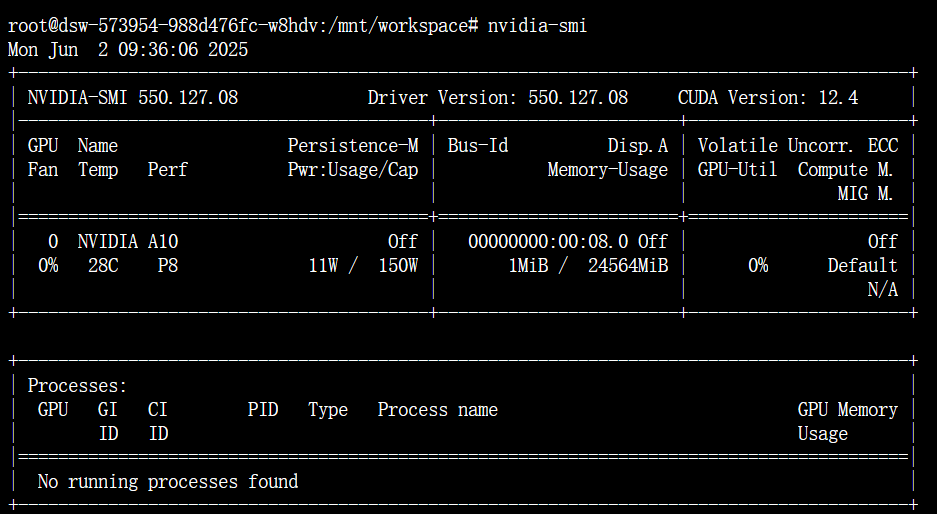
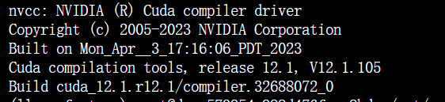
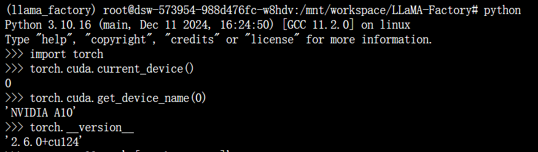

# LLaMa-Factory


- 检查GPU的当前状态和配置信息
    - 输入nvidia-smi	（可以看到显卡最高支持的cuda版本为 12.4 ，安装cuda时要注意小于等于12.4）



​	

- 输入nvcc --version	（可以看到cuda版本是12.1 ， 符合显卡要求，如果显示未找到命令则需要去安装cuda,切记要小于等于那个显卡的要求）




安装miniconda（如果有conda / miniconda 可以跳过）

[miniconda安装教程](https://www.anaconda.com/docs/getting-started/miniconda/install#quickstart-install-instructions)

```shell
mkdir -p ~/miniconda3
wget https://repo.anaconda.com/miniconda/Miniconda3-latest-Linux-x86_64.sh -O ~/miniconda3/miniconda.sh
bash ~/miniconda3/miniconda.sh -b -u -p ~/miniconda3
rm ~/miniconda3/miniconda.sh

#通过这个刷新环境
source ~/miniconda3/bin/activate


```


安装LLaMA Factory

```bash
git clone --depth 1 https://github.com/hiyouga/LLaMA-Factory.git
conda activate llama_factory
cd LLaMA-Factory
#推荐torch2.6 先把torch安装了
pip install torch==2.6.0 torchvision==0.21.0 torchaudio==2.6.0
pip install -e '.[torch,metrics]'


```


校验

```sh
python
import torch
torch.cuda.current_device()
torch.cuda.get_device_name(0)
torch.__version__
```

预期输出如图




下载模型

```shell
#通过国内的魔塔社区下载模型(需要modelscope包)
pip install modelscope
（将指定模型下载到指定目录）
modelscope download --model deepseek-ai/DeepSeek-R1-Distill-Qwen-7B  --local_dir ./models/DeepSeek-R1-Distill-Qwen-7B/
```


然后就可以准备开始微调模型

首先要有一个yaml文件（如/mnt/workspace/LLaMA-Factory/examples/train_lora/deepseek7b_lora_sft.yaml ）

然后使用如下命令即可开始训练

```sh
llamafactory-cli train examples/train_lora/deepseek7b_lora_sft.yaml 
```

deepseek7b_lora_sft.yaml 文件内容如下

```yaml
### model
#xxxxxxxxxxxxxxxxxxxxxxxxxxxxxxxxxxxx这个参数填写你模型在本地的位置
model_name_or_path: /mnt/workspace/LLaMA-Factory/models/DeepSeek-R1-Distill-Qwen-7B
trust_remote_code: true

### method
stage: sft
do_train: true
finetuning_type: lora
lora_rank: 8
lora_target: all

### dataset
#xxxxxxxxxxxxxxxxxxxxxxxxxxxxxxxxxxxx这个数据集换成自己的就可以
dataset: identity,alpaca_en_demo
#xxxxxxxxxxxxxxxxxxxxxxxxxxxxxxxxxxxx这个template参数要与训练的模型保持一致
template: deepseekr1
cutoff_len: 2048
max_samples: 1000
overwrite_cache: true
preprocessing_num_workers: 16
dataloader_num_workers: 4

### output
#xxxxxxxxxxxxxxxxxxxxxxxxxxxxxxxxxxxx训练后适配器权重的保存位置
output_dir: saves/deepseek7b/sft_test
logging_steps: 10
save_steps: 500
plot_loss: true
overwrite_output_dir: true
save_only_model: false
report_to: none  # choices: [none, wandb, tensorboard, swanlab, mlflow]

### train
per_device_train_batch_size: 1
gradient_accumulation_steps: 8
learning_rate: 1.0e-4
num_train_epochs: 3.0
lr_scheduler_type: cosine
warmup_ratio: 0.1
bf16: true
ddp_timeout: 180000000
resume_from_checkpoint: null

### eval
# eval_dataset: alpaca_en_demo
# val_size: 0.1
# per_device_eval_batch_size: 1
# eval_strategy: steps
# eval_steps: 500
```

