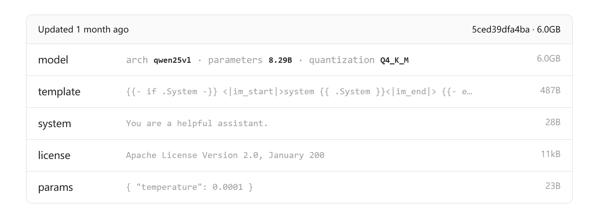
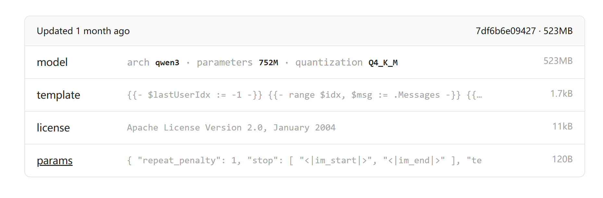

# LLaMA-Factory

## 1.windows

0. 1

    > cmd命令查看。按win+r键，在弹出的运行框中输入cmd。点击确定后，在弹出的cmd命令窗口中输入winver命令，回车后，可清晰看到windows版本信息。
    >
    > 
    >
    > windows下 cuda安装 参考链接[CUDA与CUDNN在Windows下的安装与配置（超级详细版）_windows安装cudnn-CSDN博客](https://blog.csdn.net/YYDS_WV/article/details/137825313)
    >
    > Q:当anaconda 修改了环境的安装位置（conda config --show)，但是仍然未生效时
    >
    > A:如果在cmd里检查了conda的配置信息没啥问题的话，可以去看看自己想设置的那个路径的envs的“属性”->“安全”->“编辑”->"users"看看users的权限是不是完全控制，不是的话，就改成完全控制，然后再重新闯进虚拟环境试试

    

1. 下载miniconda3（[miniconda安装包位置](https://repo.anaconda.com/miniconda/)）[miniconda 清华源](https://mirrors.tuna.tsinghua.edu.cn/anaconda/miniconda/)

    ```bash
    curl https://repo.anaconda.com/miniconda/Miniconda3-latest-Windows-x86_64.exe -o .\miniconda.exe
    start /wait "" .\miniconda.exe /S
    del .\miniconda.exe
    ```

2. 下载LLaMa-Factory项目

    ```bash
    git clone --depth 1 https://github.com/hiyouga/LLaMA-Factory.git
    conda create -n llama_factory python=3.10
    conda activate llama_factory
    cd LLaMA-Factory
    
    #安装cuda版本pytorch
    pip install torch==2.6.0 torchvision==0.21.0 torchaudio==2.6.0 --index-url https://download.pytorch.org/whl/cu126
    
    #当无法访问外网时
    pip install torch==2.6.0 torchvision==0.21.0 torchaudio==2.6.0 -f https://mirrors.aliyun.com/pytorch-wheels/cu118
    
    # 从setup.py构建python环境
    pip install -e ".[torch,metrics]" -i https://mirrors.tuna.tsinghua.edu.cn/pypi/web/simple
    
    
    #bitsandbytes windows编译
    #地址
    https://github.com/bitsandbytes-foundation/bitsandbytes
    pip install -U bitsandbytes
    
    
    # CUDA 12.6
    export CUDA_HOME=/usr/local/cuda-12.6
    export PATH=$CUDA_HOME/bin:$PATH
    export LD_LIBRARY_PATH=$CUDA_HOME/lib64:$LD_LIBRARY_PATH
    ```

3. 当我们在构建环境时可能遇到如下错误

    >pip 默认的安装逻辑
    >当运行 pip install <package> 时，pip 的行为如下：
    >
    >1. 查找最新版本的 wheel（优先选择）
    >
    >- pip 会从 PyPI 或其他配置的镜像源查找最新的、与当前系统和 Python 版本兼容的 wheel（.whl 文件）。
    >- 如果找到，直接安装该二进制包（不会选择更旧的 wheel）。
    >
    >2. 如果没有兼容的 wheel，则下载源码（.tar.gz）并尝试编译
    >
    >- pip 不会自动降级选择旧版本的 wheel，而是直接回退到源码编译。
    >- 编译需要系统依赖（如 gcc、ffmpeg 等）和 Python 开发工具（如 setuptools）。
    >
    >我们可以手动选择旧版的wheel
    >
    >遇到过的包：av , pyzmq
    >
    >pip install av  --prefer-binary 
    >
    >- 这会强制pip优先选择二进制包，即使版本比源码包旧
    >- 如果找不到任何wheel,仍然会回退到源码编译

    ```bash
    (llama) ➜  LLaMA-Factory git:(main) pip install av                                              
    Looking in indexes: https://pypi.tuna.tsinghua.edu.cn/simple
    Collecting av
      Using cached https://pypi.tuna.tsinghua.edu.cn/packages/17/89/940a509ee7e9449f0c877fa984b37b7cc485546035cc67bbc353f2ac20f3/av-15.0.0.tar.gz (3.8 MB)
      Installing build dependencies ... done
      Getting requirements to build wheel ... error
      error: subprocess-exited-with-error
      
      × Getting requirements to build wheel did not run successfully.
      ......
      ......
      note: This error originates from a subprocess, and is likely not a problem with pip.
    error: subprocess-exited-with-error
    ```

    

4. 1

5. 1


## 2.Linux

- cuda安装

    ```bash
    # cuda 安装需要 gcc 和 g++ 
    sudo apt update
    sudo apt install gcc g++
    ```

    

- 

1. 必备：CUDA、显卡驱动 、Miniconda or Conda


部署项目

```sh
git clone --depth 1 https://github.com/hiyouga/LLaMA-Factory.git
conda create -n llama_factory python=3.10
conda activate llama_factory
cd LLaMA-Factory
pip install -e ".[torch,metrics]"

import torch
torch.cuda.is_available()
torch.cuda.current_device()
torch.cuda.device_count()
torch.cuda.get_device_name(0)
torch.__version__


CUDA_VISIBLE_DEVICES=0 llamafactory-cli 
```


**[flash-attention](https://github.com/Dao-AILab/flash-attention)**

```cmd
flash_attn-2.7.4.post1+cu12torch2.2cxx11abiFALSE-cp310-cp310-linux_x86_64.whl

#cu12 指定cuda版本为12.xx
#torch2.2  指定 torch 2.2
#cp310  指定python 版本为 3.10

```


**[unsloth](https://github.com/unslothai/unsloth)**

```cmd
pip install unsloth
```


下载模型

国外：huggingface
国内：魔塔社区


12.8 pre torch


## 3.LLaMa-Factory常见问题

```python
Windows 下
#强制utf-8编码
set PYTHONUTF8=1

```


1. [加载数据集报错RuntimeError: One of the subprocesses has abruptly died during map operation.To debug the error, disable multiprocessing. · Issue #7079 · hiyouga/LLaMA-Factory (github.com)](https://github.com/hiyouga/LLaMA-Factory/issues/7079)

    > 在gradio里如何删除 `preprocessing_num_workers` 参数?我似乎找不到
    >
    > 可以用vscode在LLaMA-Factory-main\src文件夹下搜索该参数，将其值替换为None即可

    

2. [IndexError: list index out of range · Issue #5679 · hiyouga/LLaMA-Factory (github.com)](https://github.com/hiyouga/LLaMA-Factory/issues/5679)

    >你需要确保每条数据的video token数量和videos数组的长度都是完全一致的，写脚本check一下吧

3. [Qwen2.5-VL-7B-Instruct推理bug：RuntimeError: Expected all tensors to be on the same device, but found at least two devices, cuda:0 and cuda:1!](https://github.com/hiyouga/LLaMA-Factory/issues/6910) 

4. [Single-machine dual-GPU fine-tuning environment based on WSL2 Ubuntu,Although the GPU memory is sufficient, the system reports insufficient GPU memory. · Issue #8036 · hiyouga/LLaMA-Factory (github.com)](https://github.com/hiyouga/LLaMA-Factory/issues/8036)

    > 解决办法：
    > 执行：export NCCL_NSOCKS_PERTHREAD=4和export NCCL_SHM_DISABLE=1 就可以单机双卡进行微调了

    ```bash
    [rank1]: Traceback (most recent call last):
    [rank1]:   File "/root/LLaMA-Factory-main/src/llamafactory/launcher.py", line 23, in <module>
    [rank1]:     launch()
    [rank1]:   File "/root/LLaMA-Factory-main/src/llamafactory/launcher.py", line 19, in launch
    [rank1]:     run_exp()
    [rank1]:   File "/root/LLaMA-Factory-main/src/llamafactory/train/tuner.py", line 110, in run_exp
    [rank1]:     _training_function(config={"args": args, "callbacks": callbacks})
    [rank1]:   File "/root/LLaMA-Factory-main/src/llamafactory/train/tuner.py", line 72, in _training_function
    [rank1]:     run_sft(model_args, data_args, training_args, finetuning_args, generating_args, callbacks)
    [rank1]:   File "/root/LLaMA-Factory-main/src/llamafactory/train/sft/workflow.py", line 51, in run_sft
    [rank1]:     dataset_module = get_dataset(template, model_args, data_args, training_args, stage="sft", **tokenizer_module)
    [rank1]:   File "/root/LLaMA-Factory-main/src/llamafactory/data/loader.py", line 303, in get_dataset
    [rank1]:     with training_args.main_process_first(desc="load dataset", local=(not data_args.data_shared_file_system)):
    [rank1]:   File "/root/miniconda3/envs/llama_factory/lib/python3.10/contextlib.py", line 135, in __enter__
    [rank1]:     return next(self.gen)
    [rank1]:   File "/root/miniconda3/envs/llama_factory/lib/python3.10/site-packages/transformers/training_args.py", line 2451, in main_process_first
    [rank1]:     dist.barrier()
    [rank1]:   File "/root/miniconda3/envs/llama_factory/lib/python3.10/site-packages/torch/distributed/c10d_logger.py", line 81, in wrapper
    [rank1]:     return func(*args, **kwargs)
    [rank1]:   File "/root/miniconda3/envs/llama_factory/lib/python3.10/site-packages/torch/distributed/distributed_c10d.py", line 4635, in barrier
    [rank1]:     work = group.barrier(opts=opts)
    [rank1]: torch.distributed.DistBackendError: NCCL error in: /pytorch/torch/csrc/distributed/c10d/ProcessGroupNCCL.cpp:3356, unhandled cuda error (run with NCCL_DEBUG=INFO for details), NCCL version 2.26.2
    [rank1]: ncclUnhandledCudaError: Call to CUDA function failed.
    [rank1]: Last error:
    [rank1]: Cuda failure 2 'out of memory'
    W0801 16:07:20.955000 1648 site-packages/torch/distributed/elastic/multiprocessing/api.py:900] Sending process 1669 closing signal SIGTERM
    E0801 16:07:21.020000 1648 site-packages/torch/distributed/elastic/multiprocessing/api.py:874] failed (exitcode: 1) local_rank: 1 (pid: 1670) of binary: /root/miniconda3/envs/llama_factory/bin/python3.10
    Traceback (most recent call last):
      File "/root/miniconda3/envs/llama_factory/bin/torchrun", line 8, in <module>
        sys.exit(main())
      File "/root/miniconda3/envs/llama_factory/lib/python3.10/site-packages/torch/distributed/elastic/multiprocessing/errors/__init__.py", line 355, in wrapper
        return f(*args, **kwargs)
      File "/root/miniconda3/envs/llama_factory/lib/python3.10/site-packages/torch/distributed/run.py", line 892, in main
        run(args)
      File "/root/miniconda3/envs/llama_factory/lib/python3.10/site-packages/torch/distributed/run.py", line 883, in run
        elastic_launch(
      File "/root/miniconda3/envs/llama_factory/lib/python3.10/site-packages/torch/distributed/launcher/api.py", line 139, in __call__
        return launch_agent(self._config, self._entrypoint, list(args))
      File "/root/miniconda3/envs/llama_factory/lib/python3.10/site-packages/torch/distributed/launcher/api.py", line 270, in launch_agent
        raise ChildFailedError(
    torch.distributed.elastic.multiprocessing.errors.ChildFailedError:
    ============================================================
    /root/LLaMA-Factory-main/src/llamafactory/launcher.py FAILED
    ------------------------------------------------------------
    Failures:
      <NO_OTHER_FAILURES>
    ------------------------------------------------------------
    Root Cause (first observed failure):
    [0]:
      time      : 2025-08-01_16:07:20
      host      : DESKTOP-356K2N7.localdomain
      rank      : 1 (local_rank: 1)
      exitcode  : 1 (pid: 1670)
      error_file: <N/A>
      traceback : To enable traceback see: https://pytorch.org/docs/stable/elastic/errors.html
    ============================================================
    Traceback (most recent call last):
      File "/root/miniconda3/envs/llama_factory/bin/llamafactory-cli", line 8, in <module>
        sys.exit(main())
      File "/root/LLaMA-Factory-main/src/llamafactory/cli.py", line 130, in main
        process = subprocess.run(
      File "/root/miniconda3/envs/llama_factory/lib/python3.10/subprocess.py", line 526, in run
        raise CalledProcessError(retcode, process.args,
    subprocess.CalledProcessError: Command '['torchrun', '--nnodes', '1', '--node_rank', '0', '--nproc_per_node', '2', '--master_addr', '127.0.0.1', '--master_port', '45271', '/root/LLaMA-Factory-main/src/llamafactory/launcher.py', 'saves/Qwen3-8B-Thinking/lora/train_2025-08-01-16-00-41/training_args.yaml']' returned non-zero exit status 1.
    ```

    

```bash

```


## 4.ollama

```sh
(llama_factory) ➜  LLaMA-Factory-main ollama list             
NAME            ID              SIZE      MODIFIED       
qwen2.5vl:3b    fb90415cde1e    3.2 GB    44 seconds ago    
qwen3:0.6b      7df6b6e09427    522 MB    6 hours ago 

(llama_factory) ➜  LLaMA-Factory-main ollama show --modelfile qwen2.5vl:3b 
```

qwen25vl


qwen3



```modelfile
# Modelfile generated by "ollama show"
# To build a new Modelfile based on this, replace FROM with:
# FROM qwen2.5vl:3b

FROM ./xxx.gguf
TEMPLATE """
xx从ollama上找模型的templatexxx
"""
#else parameters

#qwen25vl
SYSTEM You are a helpful assistant.
#params
PARAMETER temperature 0.0001


##qwen3
PARAMETER top_k 20
PARAMETER top_p 0.95
PARAMETER repeat_penalty 1
PARAMETER stop <|im_start|>
PARAMETER stop <|im_end|>
PARAMETER temperature 0.6

```
