## WSL2安装

### 一、安装WSL2

1. 搜索**启用或关闭Windows功能**

2. 启用wsl和虚拟机平台

    - 找到并勾选以下两项/三项，然后点击 **确定**，系统将开始应用更改。随后会弹出提示要求重启计算机，点击 **立即重新启动(N)** 以完成设置。
        - **适用于 Linux 的 Windows 子系统**
        - **虚拟机平台 **
        - ###### **Windows 虚拟机监控程序平台**

    - 如果你使用的是 Windows 11，还需要勾选：
        - **Windows Hypervisor Platform**（有些系统可能没有）
        - **Hyper-V**（如果你的 Windows 版本支持）

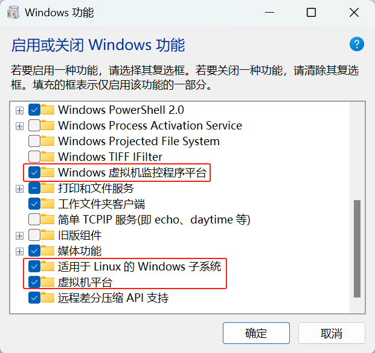

3. 将 WSL 默认版本设置为 WSL2（视情况而定）

   >wsl --set-default-version 2

   ```shell
   Windows 11 默认已安装 WSL2，不需要执行该命令。
   Windows 10 用户 需要执行此命令，否则默认使用 WSL1。
   ```

4. 重启电脑

   以上命令执行完成后，请重启电脑，以确保所有更改生效。

### 二、WSL2安装Ubuntu-22.04至 `D盘` （方法一|推荐）

1. 创建文件夹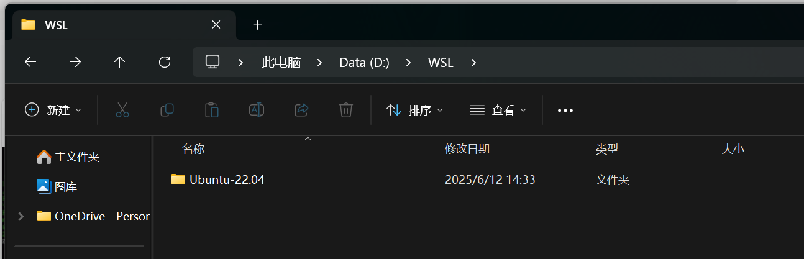

2. 下载并导出 Ubuntu-22.04

    1. 首先,查看可用的WSL发行版:
        >wsl --list --online 
        >
        >如出现下述错误，请挂 **梯子**
        >PS C:\Users\L> wsl --list --online                                                                                      无法从“https://raw.githubusercontent.com/microsoft/WSL/master/distributions/DistributionInfo.json”中提取列表分发。无法解析服务器的名称或地址                                                                                                  错误代码: Wsl/WININET_E_NAME_NOT_RESOLVED 

        如图所示为终端输出：

        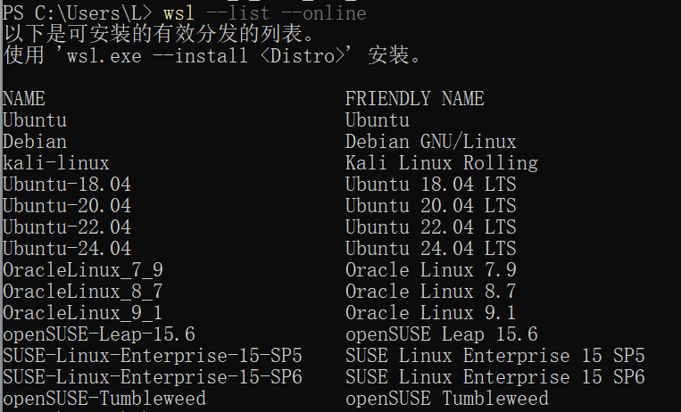

    2. 安装 **Ubuntu-20.04** ：

        >wsl --install -d Ubuntu-20.04

    ​							

    3. 安装完毕后会要求你创建一个新用户，按照提示输入用户名和密码即可，此时已经安装成功了。然后按 `Ctrl + D` 退出即可

       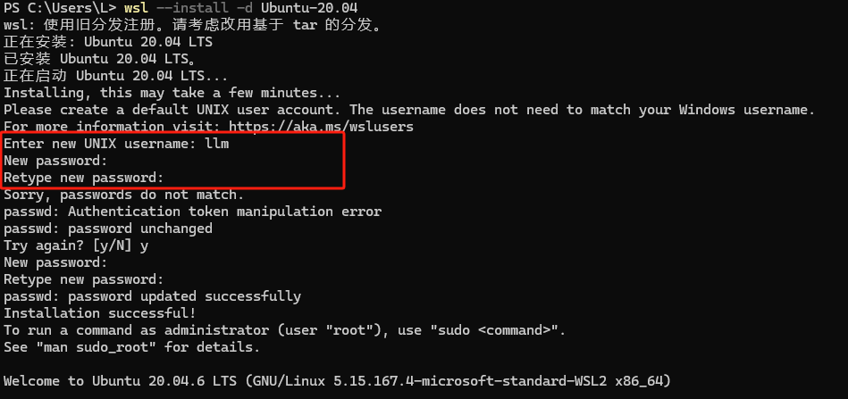

    4. 导出 **Ubuntu-20.04** 为 `.tar` 文件

       ```powershell
       wsl --export Ubuntu-20.04 D:\WSL\Ubuntu-20.04\Ubuntu-20.04.tar
       ```

       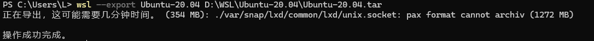

       这会下载 Ubuntu-20.04 并将其导出到 `D:\WSL\Ubuntu-20.04\Ubuntu-20.04.tar`，然后可以执行`ls D:\WSL\Ubuntu-20.04`查看`Ubuntu-20.04.tar`已经成功导出。

    5. 取消注册原有的 Ubuntu-20.04，如果你已经安装了 Ubuntu-20.04（默认在 `C` 盘），可以将其从 WSL 注销：

       ```powershell
       wsl --unregister Ubuntu-20.04
       ```

       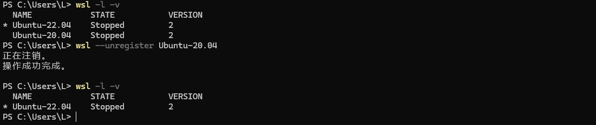

3. 导入 Ubuntu-20.04 到 D 盘

    1. 运行以下命令，将 Ubuntu-20.04 重新导入到 `D:\WSL\Ubuntu-20.04`：

       ```powershell
       wsl --import Ubuntu-20.04 D:\WSL\Ubuntu-20.04 D:\WSL\Ubuntu-20.04\Ubuntu-20.04.tar --version 2
       ```

       

       这将会把 `Ubuntu-20.04` 安装到 `D` 盘，而不是默认的 `C` 盘，如图所示安装完毕。

       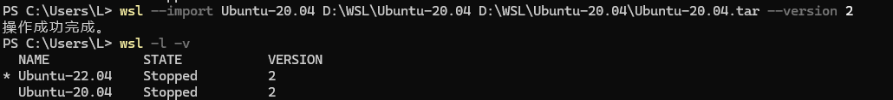

       此时可以看到Ubuntu20.04已经成功安装

    2. 在 `D:\WSL\Ubuntu-20.04` 目录下，WSL2 发行版的文件存储在一个 **虚拟磁盘映像文件（ext4.vhdx）** 中，该文件用于存储整个 Ubuntu-20.04 文件系统，如下图所示：

       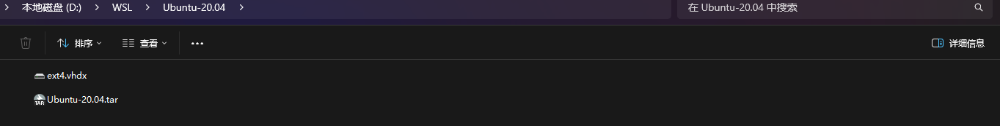

    3. 启动Ubuntu20.04

       ```powershell
       wsl -d Ubuntu-22.04
       ```

       


### 三、WSL2安装Ubuntu-22.04至 `D盘` （方法二）

1. 创建文件夹

2. 离线下载Ubuntu安装包

    1. 首先到微软软件商店的网页版，找到所需版本对应的链接，**复制链接**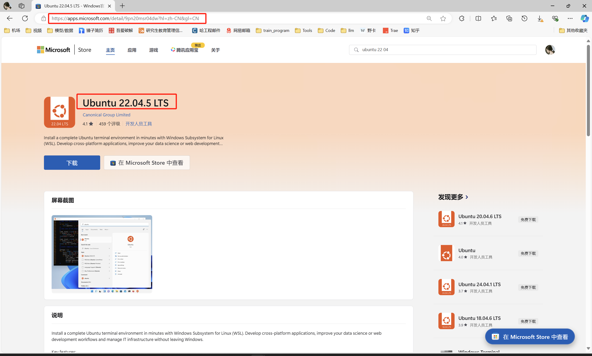

    2. 打开这个网站:[下载包](https://blog.csdn.net/lpwmm/article/details/106117056)，将上面复制的链接粘贴到搜索栏中(搜索类型使用默认的URL(link))

        **找到名称匹配一致的版本**的链接,注意后缀应该**是.appxbundle**的链接(bundle表示包含所有相关文件)。**点击上图下方的超链接即可自动下载**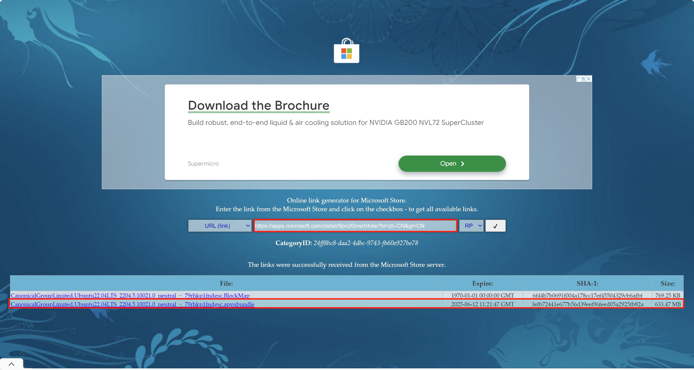

         3. 下载完成后，将文件移动到目标目录：`D:\WSL\Ubuntu-20.04\`

       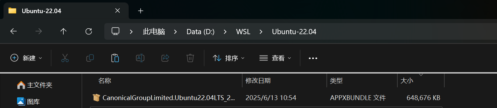

   3. 解压`.appx` 文件

      1. 在`D:\WSL\Ubuntu-22.04`目录下以管理员权限打开PowerShell

      2. Windows 不支持直接运行 `.appx`，所以你需要手动解压，继续运行：
   
          ```sh
           Rename-Item .\CanonicalGroupLimited.Ubuntu22.04LTS_2204.5.10021.0_neutral_~_79rhkp1fndgsc.AppxBundle Ubuntu-22.04.zip
           Expand-Archive .\Ubuntu-22.04.zip .\Extracted\
          ```

          命令：	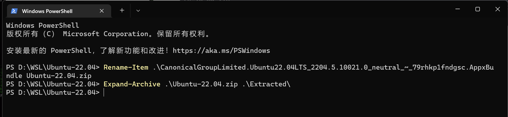

          效果：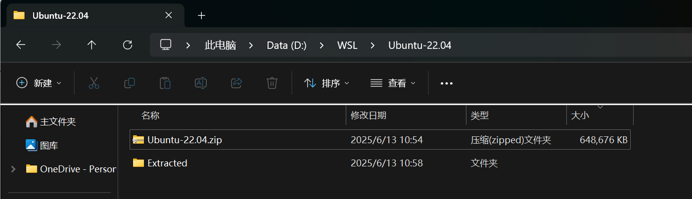

   4. 进入 `D:\WSL\Ubuntu-22.04\Extracted` 目录，执行：
   
      ```shell
      cd Extracted
      Rename-Item .\Ubuntu_2204.5.10021.0_x64.appx Ubuntu_22.04.zip
      Expand-Archive .\Ubuntu_22.04.zip .\Ubuntu_x64
      ```

      命令：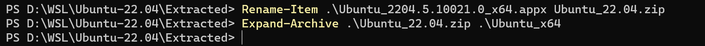

      效果：如图所示成功解压出 **Ubuntu_x64** 文件夹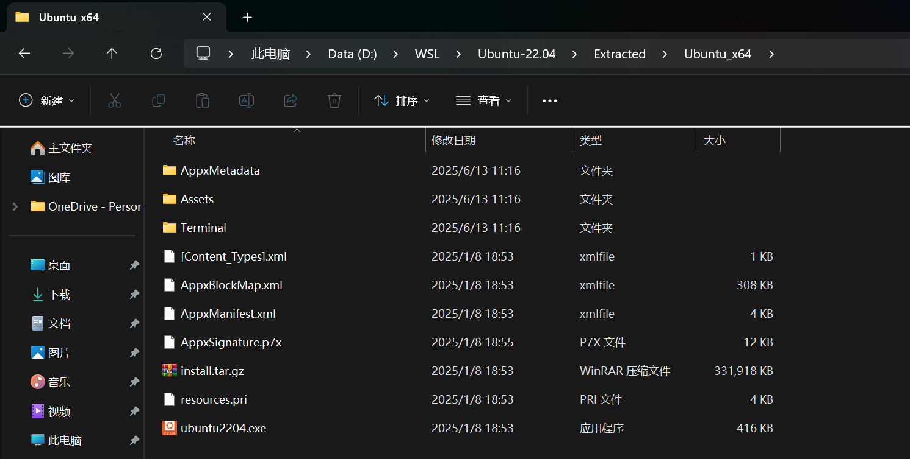
   
   5. 导入 WSL 并启动Ubuntu
   
       1. 进入 **Ubuntu_x64** 目录，手动导入 WSL，在 `D:\WSL\Ubuntu-22.04\Extracted\Ubuntu_x64` 目录下执行：
   
           ```cmd
           cd Ubuntu_x64
           wsl --import  Ubuntu-22.04 D:\WSL\Ubuntu-22.04\ .\install.tar.gz --version 2
           ```
   
           效果：
   
       2. 启动 Ubuntu，执行：
   
           ```cmd
           wsl -d Ubuntu-22.04
           ```
   
           但此时，你会发现默认以 `root` 用户登录，因为 WSL 手动导入的 Ubuntu 不会自动创建普通用户，需要我们手动创建。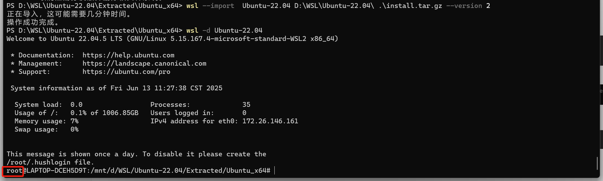
   
   6. 创建普通用户并设置默认用户（可选）
   
       1. 创建新用户，在 WSL 终端（默认 `root`）下运行：
   
           ```cmd
           adduser yourusername    # 请把 yourusername 替换为你想使用的用户名
           ```
   
           >系统会要求你输入：
           >
           >- 新密码
           >- 用户信息（全部可以直接回车跳过）
   
           ​	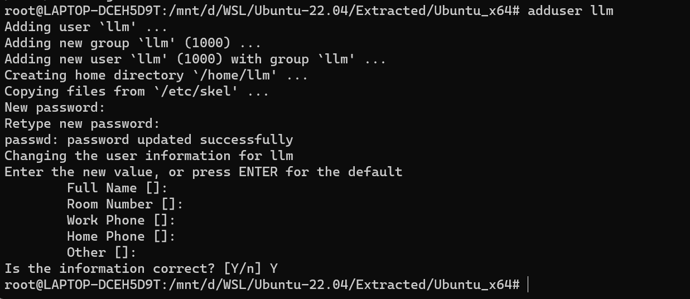
   
       2. 赋予新用户 `sudo` 权限
   
           ```cmd
           usermod -aG sudo yourusername
           ```
   
            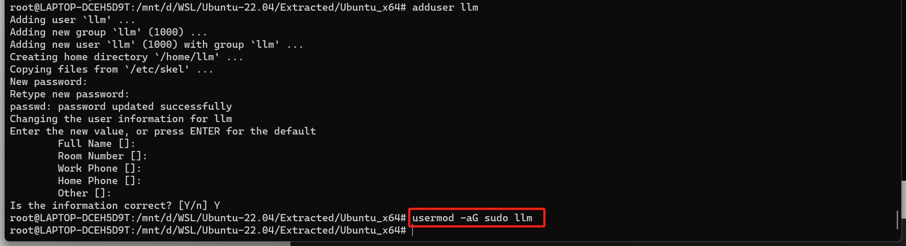
   
       3. 修改默认用户，在 **Windows PowerShell** 中运行：
   
           ```cmd
           wsl -d Ubuntu-22.04 -u yourusername # 仅本次以普通用户登录
           ```
   
           如图所示成功以 **普通用户** 登录。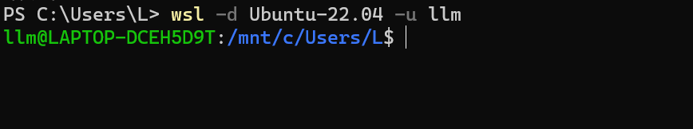
   
           
   
   7. 确认安装成功
   
       1. 关闭并重启 WSL
   
           ```cmd
           wsl --shutdown
           ```
   
       2. 确认安装成功
   
           ```cmd
           wsl -l -v
           ```
   
           如果输出类似下图，说明 **WSL2** 已经成功安装，并已将 **Ubuntu-20.04** 安装至 `D盘`。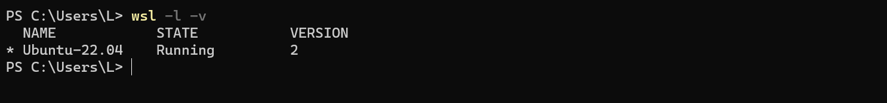
   
       3. 在 `D:\WSL\Ubuntu-22.04` 目录下，WSL2 发行版的文件存储在一个 **虚拟磁盘映像文件（ext4.vhdx）** 中，该文件用于存储整个 Ubuntu-22.04 文件系统，如下图所示：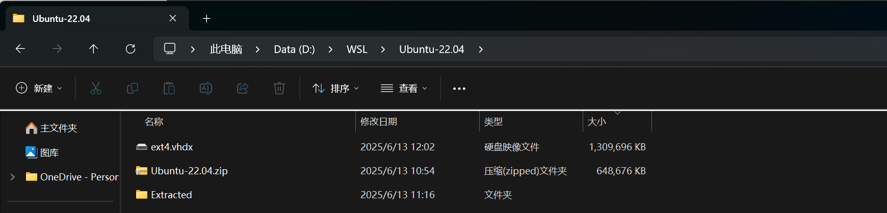

### 四、常用命令

- 关闭Ubuntu系统

    ```cmd
    wsl --shutdown
    ```

- 启动Ubuntu系统

    ```cmd
    wsl -d Ubuntu-22.04
    wsl -d Ubuntu-22.04 -u llm          #以llm 用户身份登录
    ```

- 更改默认登录用户

    在Ubuntu子系统中，修改 `/etc/wsl.conf` 文件

    ```cmd
    sudo vi /etc/wsl.conf
    
    #/etc/wsl.conf 文件内容
    [boot]                                                                                                       
    systemd=true                                                                                                 
    #增加如下内容
    [user]                                                                                                       
    default=llm 
    ```
    
    

### 五、ZSH安装

1. oh-my-zsh

    ```shell
    sudo apt install zsh         # 安装zsh
    sh -c "$(curl -fsSL https://gitee.com/Devkings/oh_my_zsh_install/raw/master/install.sh)"  # oh-my-zsh
    
    #插件
    git clone https://github.moeyy.xyz/https://github.com/zsh-users/zsh-autosuggestions ${ZSH_CUSTOM:-~/.oh-my-zsh/custom}/plugins/zsh-autosuggestions        # 自动补全
    
    git clone https://github.moeyy.xyz/https://github.com/zsh-users/zsh-syntax-highlighting.git ${ZSH_CUSTOM:-~/.oh-my-zsh/custom}/plugins/zsh-syntax-highlighting    # 语法高亮
    
    # 修改.zshrc 文件，启动插件
    plugins=(git zsh-autosuggestions zsh-syntax-highlighting z extract web-search)
    
    ```

    